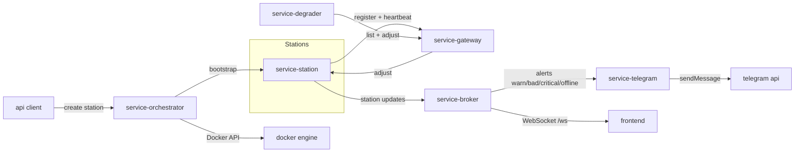

# Vakula microservices sandbox (Docker-ready)

This project simulates Croatian weather stations as microservices.

## Services

- **service-gateway** (`service-gateway/server.py`)
  - API gateway / registrar for stations
  - Stations register on startup and send heartbeats
  - Adjust commands are forwarded via the gateway

- **service-station** (`service-station/server.py`)
  - One instance per *physical* station
  - Keeps per-module health (temperature / wind / rain / snow)
  - Accepts `/adjust` commands (negative = degrade, positive = repair)
  - Pushes its current state to the broker

- **service-broker** (`service-broker/server.py`)
  - Central world state for the frontend
  - Receives `/api/station-update` from stations
  - Broadcasts map state to the frontend over WebSocket `/ws`

- **service-degrader** (`service-degrader/server.py`)
  - Periodically picks a random registered station and module
  - Issues adjust commands via the gateway

- **service-telegram** (`service-telegram/server.py`)
  - Accepts a message and sends it to a Telegram chat

- **service-orchestrator** (`service-orchestrator/server.py`)
  - Creates new station containers via the Docker HTTP API (array-only payloads)

- **frontend** (`frontend/index.html`)
  - Leaflet-based map of Croatia with stations colour-coded by health
  - Connects to the broker WebSocket on `ws://<host>:8001/ws`
  - Not counted as a microservice (UI only)

## Architecture diagram



## Repository structure

```
.
├── service-gateway
├── service-station
├── service-broker
├── service-degrader
├── service-telegram
├── service-orchestrator
├── frontend
└── docker-compose.sample.yml
```

Each microservice directory contains its own `README.md` and `requirements.txt` for local development.

## Local development (per service)

1. Open the service directory (e.g., `service-gateway`).
2. Create a virtual environment and install dependencies as described in the service README.
3. Export the required environment variables listed in the service README.
4. Run `python server.py`.

## Run everything with Docker

You need **Docker** and **docker compose**.

1. Copy the sample compose file and fill in secrets:

```bash
cp docker-compose.sample.yml docker-compose.yml
```

2. Build and start all services:

```bash
docker compose up --build
```

This will start:
- `gateway` on port **8000**
- `broker` on port **8001**
- `degrader` (no exposed port)
- `telegram` on port **8002**
- `orchestrator` on port **8003**
- `frontend` on port **8080**
- One container per station (defined in `docker-compose.yml`)

2. Open the frontend in your browser:

```text
http://localhost:8080/index.html
```

The page will connect to the broker at `ws://localhost:8001/ws`.

## Notes

- Stations are created manually by POSTing to the orchestrator `POST /api/stations`.
- All internal service discovery uses Docker's default network:
  - `gateway` is reachable as `http://gateway:8000`
  - `broker` as `http://broker:8001`
  - Each station container as `http://station_<Name>:9000`
- No database is used; everything is in memory.
